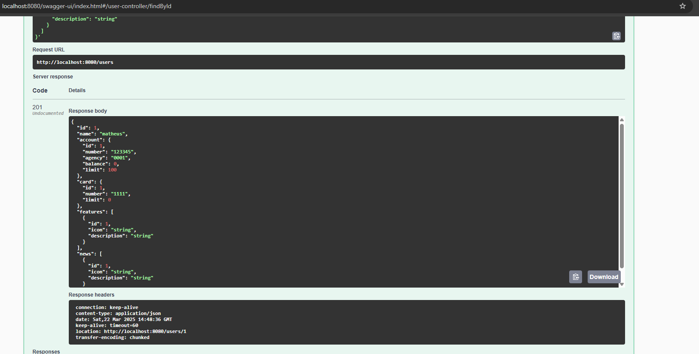
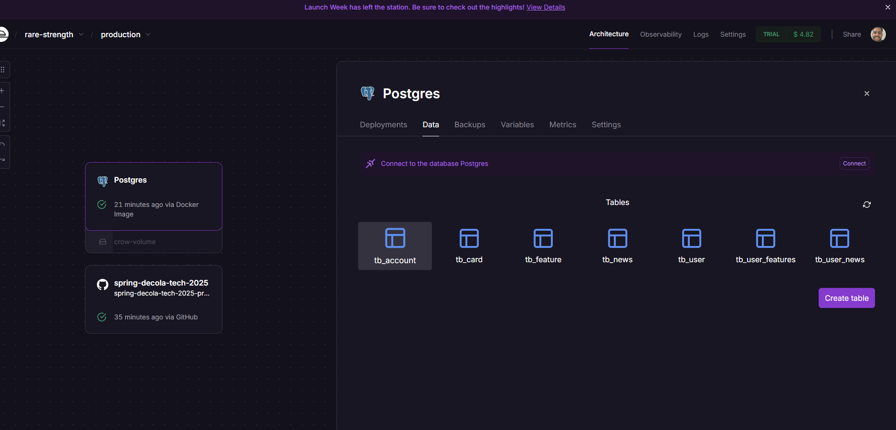
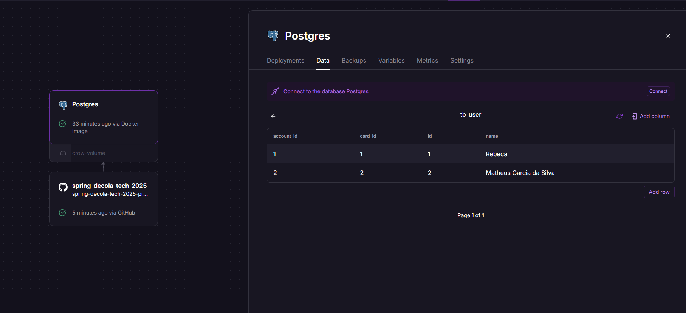

# Spring Decola Tech 2025 🚀

Este projeto consiste em uma API RESTful desenvolvida em Java utilizando o Spring Boot, criada durante o Bootcamp Decola Tech 2025, promovido pela Digital Innovation One (DIO) em parceria com a Avanade. ([dio.me](https://www.dio.me/))

## Tecnologias Utilizadas 💻

### Principais Stack

### Banco de Dados

### Acessando o Projeto 🌐

#### **API (Produção)**
- **URL:** [https://spring-decola-tech-2025-production-afd1.up.railway.app/swagger-ui/index.html](https://spring-decola-tech-2025-production-afd1.up.railway.app/swagger-ui/index.html)
- **Descrição:** Endpoint da API em ambiente de produção, hospedado no Railway.

#### **Swagger UI (Local)**
- **URL:** [http://localhost:8080/swagger-ui/index.html](http://localhost:8080/swagger-ui/index.html)
- **Descrição:** Interface do Swagger para visualização e teste dos endpoints da API localmente.

#### **H2 Console (Local)**
- **URL:** [http://localhost:8080/h2-console](http://localhost:8080/h2-console)
- **Descrição:** Console do banco de dados H2 para acesso e gerenciamento dos dados durante o desenvolvimento.

### Galeria do Projeto 📸

Aqui estão algumas imagens que mostram o funcionamento e a estrutura do projeto:

#### 1. **Swagger UI**

#### 2. **Banco Postgre no Railway**

#### 3. **Funcionamento do Banco**

## Conclusão 🏁

O projeto da API spring foi uma experiência enriquecedora que me permitiu aplicar os conhecimentos adquiridos no Bootcamp Decola Tech, promovido pela Digital Innovation One em parceria com a Avanade. Através do desenvolvimento desta API RESTful com Spring Boot, pude:

- Implementar operações CRUD completas e eficientes.
- Integrar a API com bancos de dados (H2 para desenvolvimento e PostgreSQL para produção).
- Documentar a API de forma clara e acessível usando Swagger UI.
- Configurar múltiplos ambientes e realizar o deploy no Railway.

### Principais Aprendizados 📚
- Domínio do ecossistema Spring Boot e suas principais bibliotecas.
- Boas práticas de desenvolvimento, como organização de código e tratamento de exceções.
- Experiência prática com deploy em nuvem e integração contínua

Agradeço à [Digital Innovation One](https://www.dio.me/) e à [Avanade](https://www.avanade.com/) por esta oportunidade incrível de aprendizado e crescimento profissional!
